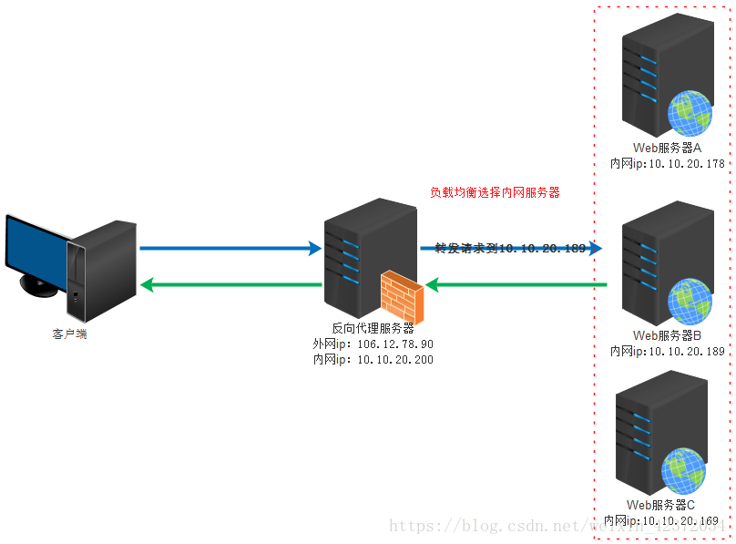
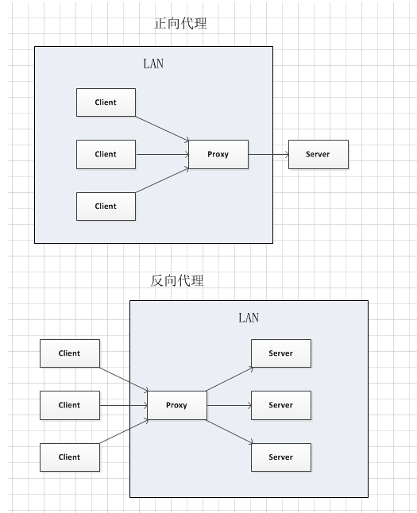

## 利用反向代理实现跨域的请求

### Axios

Axios 是一个基于 promise 的 HTTP 库，可以用在浏览器和 node.js 中。 

它具有以下特征：

- 从浏览器中创建 [XMLHttpRequests](https://developer.mozilla.org/en-US/docs/Web/API/XMLHttpRequest)
- 从 node.js 创建 [http](http://nodejs.org/api/http.html) 请求
- 支持 [Promise](https://developer.mozilla.org/en-US/docs/Web/JavaScript/Reference/Global_Objects/Promise) API
- 拦截请求和响应
- 转换请求数据和响应数据
- 取消请求
- 自动转换 JSON 数据
- 客户端支持防御 [XSRF](http://en.wikipedia.org/wiki/Cross-site_request_forgery)


### Promise.resolve(value)

返回一个以给定值解析后的Promise对象。但如果这个值是个thenable（即带有then方法），返回的promise会“跟随”这个thenable的对象，采用它的最终状态（指resolved/rejected/pending/settled）；如果传入的value本身就是promise对象，则该对象作为Promise.resolve方法的返回值返回；否则以该值为成功状态返回promise对象。


### 正向代理

正向代理 是一个位于客户端和原始服务器(origin server)之间的服务器，为了从原始服务器取得内容，客户端向代理发送一个请求并指定目标(原始服务器)，然后代理向原始服务器转交请求并将获得的内容返回给客户端。客户端必须要进行一些特别的设置才能使用正向代理。  

正向代理的作用：

+ 访问原来无法访问的资源，如google 
+ 可以做缓存，加速访问资源
+ 对客户端访问授权，上网进行认证
+ 代理可以记录用户的访问记录，对外隐藏用户的信息


### 反向代理

反向代理（Reverse Proxy）实际运行方式是指以代理服务器来接受internet上的连接请求，然后将请求转发给*内部网络上的服务器*，并将从服务器上得到的结果返回给internet上请求连接的客户端，此时代理服务器对外就表现为一个服务器。

反向代理的作用：

+ 保证内网的安全，可以使用反向代理提供WAF功能，阻止web攻击 大型网站，通常将反向代理作为公网访问地址，Web服务器是内网。 
+ 负载均衡，通过反向代理服务器来优化网站的负载。




### 反向代理该如何理解

在正向代理中，proxy和client同属于一个LAN，对server而言是透明的。

在反向代理中，proxy和server同属于一个LAN，对client而言是透明的。

而实际上proxy在两种代理中做的事都是代为收发请求和响应，不过从结构上来看正好左右互换了一下，这种结构上的互换就致使后出现的那种代理方式叫做了反向代理。




### 反向代理实现方法

##### 1.封装请求的api
以一个get请求为例

```javascript
import {commonParams} from 'somewhere'
export function getSongList() {
  const url = 'api/getSomeInfo'
  const data = Object.assign({}, commonParams, {
    key1: value1,
    key2: value2,
    key3: value3,
    ...
  })

  return axios.get(url, {
    params: data
  }).then(res => {
    return Promise.resolve(res.data)
  })
}
```

##### 2.开发模式下配置ProxyTable

```javascript
proxyTable: {
  '/api/getSomeInfo': {
    target: 'https://xxxx', // 目标地址
    changeOrigin: true, // 允许跨域
    secure: false, // 如果是https接口，需要配置这个参数
    bypass:function(req,res,proxyOptions){
      req.headers.referer='https://xxxx'; // 请求referer
      req.headers.host='xxx'; // 也可以不写，请求会自动发送host
    },
    pathRewrite: {
      '^/api/getSongList': ''
    }
  }
}
```
##### 3.在代码中调用封装好的api

```javascript
_getSomeInfo () {
  getDiscList().then((res) => {
    if (res.status === ERR_OK) {
      console.log(res.data) // 这样就取到数据了
    }
  })
}
```


这样的话在开发模式下就已经可以实现跨域请求，但是这样设置在打包上线后并不能实现跨域。（因为有的项目前端代码和后台代码并不在一个服务器上），所以还有一种方法可以解决上线后跨域的问题。


##### 4.另一种方法

在webpack.dev.conf.js中

```javascript
const axios = require('axios') // 使用axios
const app = express()
const apiRoutes = express.Router() // 定义一个API的routes
app.use('/api', apiRoutes)

devServer: {
  // 在发送请求之前伪造refer,host
  before(app) {
    app.get('/getSomeInfo', function (req, res) {
      var url = 'https://xxxx' // 目标地址
      axios.get(url, {
        headers: {
          referer: 'https://xxxx', // 伪造referer
          host: 'xxx' // 伪造host
        },
        // params是即将与请求一起发送的url参数，无格式对象/URLSearchParams对象
        params: req.query
      }).then((response) => {
        res.json(response.data)
      }).catch((e) => {
        console.log(e)
      })
    })
  }
}
```

然后调用api发送请求的方式和第一点相同。至此，就成功实现了利用反向代理实现跨域请求。

